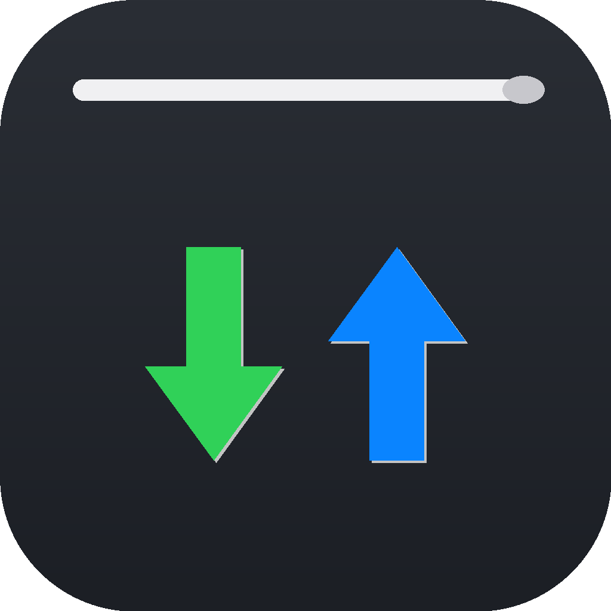
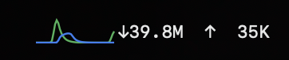
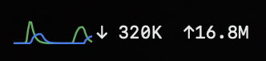
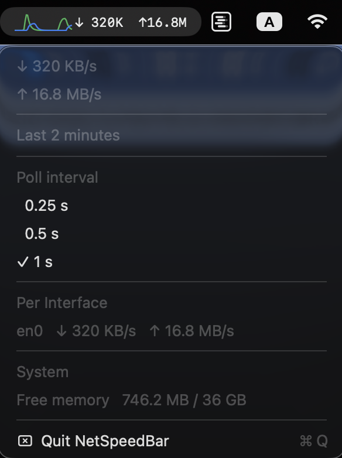

# NetSpeedBar

<p align="center">
  
</p>

A tiny macOS menu-bar app that shows live network upload/download speed.

## Why I made this

I built NetSpeedBar because I couldn’t find a simple, malware-free macOS network speed monitor that just did the bare minimum. Most alternatives were bloated, ad-ridden, or came with bundled junk I didn’t want. This app does one thing: show your live upload and download speeds in the menu bar.

## What it does

- Shows current download (green) and upload (blue) speeds in the menu bar.
- Click the icon to see:
  - Exact numeric speeds.
  - A 2-minute live graph.
  - A poll-interval picker.
  - Per-interface traffic breakdown.
   - Free memory and total memory.
   - A **Quit** button.

## Screenshots

<p align="center">
  
  &nbsp;
  
  <br><br>
  
</p>

## Requirements

- macOS 13 (Ventura) or later.
- Xcode command-line tools / Swift 5.9+.

## Download

Pre-built releases are available on the [Releases](https://github.com/akaler/NetworkSpeedBar/releases) page.

1. Download the latest `NetSpeedBar-vX.X.X.zip`.
2. Unzip it.
3. Double-click **NetSpeedBar.app** to launch.

> **Note:** Because the app isn't signed with a paid Apple Developer ID, macOS Gatekeeper may warn that the developer can't be verified. To run it, right-click the app and choose **Open**, or remove the quarantine flag in Terminal:
>
>     xattr -dr com.apple.quarantine NetSpeedBar.app

## Build

Run the build script:

```bash
./bundle.sh
```

This creates `build/NetSpeedBar.app`.

## Run

```bash
open build/NetSpeedBar.app
```

The app has no dock icon; it lives only in the menu bar.

## Quit

Click the menu-bar icon and choose **Quit NetSpeedBar** (or press `q`).

## Project layout

```
Sources/NetSpeedBar/
  AppConstants.swift      # Shared colors and settings
  NetSpeedApp.swift       # App entry point, menu-bar button, and dropdown menu
  NetworkMonitor.swift    # Polls network counters and publishes speed data
  Formatters.swift        # Pretty-prints speeds as MB/s, KB/s, etc.
  BarSparkline.swift      # Tiny trend graph in the menu bar
  SpeedGraphView.swift    # Larger graph inside the dropdown
  SystemMonitor.swift     # Free memory and CPU temperature sensors
```

## How it works

Every second the app reads per-interface byte counters via macOS's `getifaddrs()`. It diffs those counters against the previous sample to compute bytes-per-second rates, then updates the menu bar and graph.

The system-info row reads Mach memory counters.
